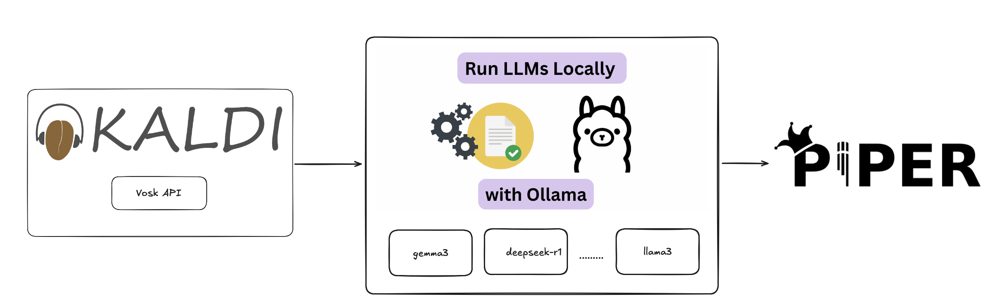

# AI Voice Assistant

This project is a real-time AI-powered voice assistant that listens to user input, generates responses using an AI model, and speaks the responses back to the user. It leverages speech recognition, AI response generation, and text-to-speech synthesis to create a seamless interactive experience.


---

## Features

- **Lightweight and Fast:** Optimized for performance, successfully tested on Raspberry Pi 5 with no noticeable delays.

- **Voice Input:** Uses Vosk for speech-to-text conversion.
- **AI Response:** Integrates with the Ollama AI model to generate responses.
- **Voice Output:** Uses Piper for text-to-speech conversion.
- **Real-Time Interaction:** Continuously listens and responds to user input.

---

## Installation

### Prerequisites

- Python 3.8+
- [Vosk Model for Ukrainian](https://alphacephei.com/vosk/models) (or any other language model)
- [Piper TTS](https://github.com/rhasspy/piper) for voice synthesis
- [Ollama API](https://ollama.com/) for AI responses

### Install Dependencies

Install the required Python packages:

```bash
pip install pyaudio numpy vosk sounddevice ollama
```

---

## Configuration

1. **Model Paths:** Make sure to update the paths in the code to point to your local models:

   - Speech-to-text model path: `models/vosk-model-uk-v3`
   - Text-to-speech model and config paths:
     - `voices/uk_UA-ukrainian_tts-medium.onnx`
     - `voices/uk_UA-ukrainian_tts-medium.onnx.json`

2. **Audio Device Index:**
   - Check your available audio devices using:
     ```bash
     python -m sounddevice
     ```
   - Update the `DEVICE_INDEX` in `speech_to_text.py` accordingly.

---

## Running the Voice Assistant

Start the assistant using:

```bash
python main.py
```

### Usage

1. The assistant will start listening for your voice input.
2. Once speech is detected, it will be recorded and processed.
3. The recognized text will be displayed on the screen.
4. The assistant will generate a response using the AI model.
5. The response will be spoken out loud.

---

## Code Structure

```
.
├── main.py               # Entry point for the voice assistant
├── speech_to_text.py      # Speech recognition using Vosk
├── text_to_speech.py      # Text-to-speech using Piper
└── ai_chat.py             # AI response generation using Ollama
```

---

## Troubleshooting

1. **No Audio Input Detected:**

   - Make sure your microphone is properly connected and configured.
   - Check the device index in `speech_to_text.py`.

2. **Slow or No Response:**

   - Decrease the chunk size or adjust the silence threshold.

3. **Error During AI Generation:**

   - Ensure the Ollama API is correctly configured.

4. **Voice Not Playing:**
   - Check your output device configuration in `text_to_speech.py`.

---

## Customization

- **AI Model Prompt:**
  Modify the `PROMPT` variable in `ai_chat.py` to customize the assistant's behavior.

- **Voice and Speaker Configuration:**
  Adjust the `VOICE_MODEL_PATH`, `VOICE_CONFIG_PATH`, and `SPEAKER` variables in `text_to_speech.py` to change the TTS model or voice.

---

## Acknowledgments

- [Vosk Speech Recognition](https://alphacephei.com/vosk/)
- [Piper Text-to-Speech](https://github.com/rhasspy/piper)
- [Ollama AI Model](https://ollama.com/)

---

Feel free to reach out for support or suggestions! 🎙️🤖🔊
